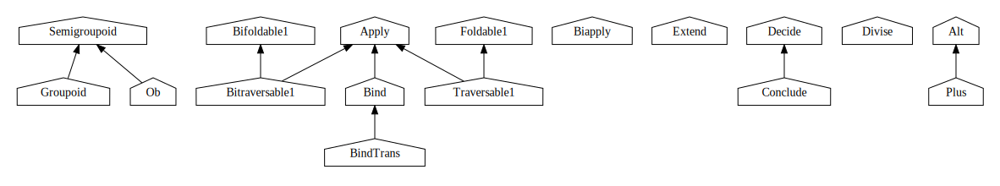
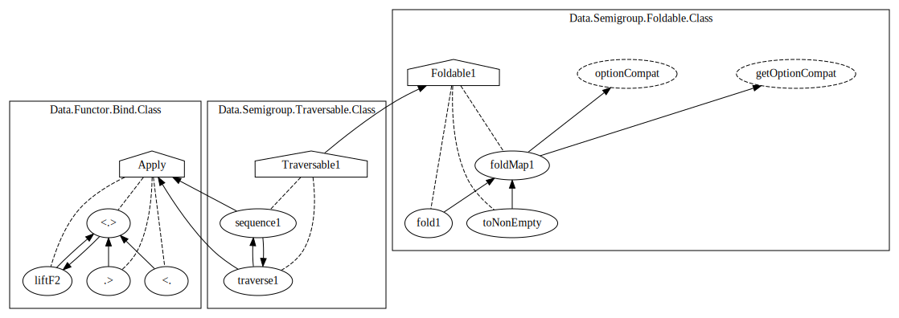

Today, I released [`calligraphy`](https://github.com/jonascarpay/calligraphy), a Haskell call graph/source code visualizer.
In this post, I'll walk you how to actually use it.
Before we begin, I recommend scrolling through the article to get an idea of the kinds of graphs we'll be creating.

# First strokes

## Installation

The first step is to install the `calligraphy` executable.
I can't really help you out here, you have to install it the way you install all Haskell applications.
The big thing to look out for is that, like most Haskell tooling, the `calligraphy` executable _has to be compiled with the same version of GHC as the project you want to use it with_.
If `calligraphy` starts throwing errors like `"The impossible happened!"`, it's probably a version mismatch between `calligraphy` and GHC.

The second step is to make sure you have [GraphViz](https://graphviz.org/) installed.
Calligraphy uses `dot` from the GraphViz package to render its graphs, make sure that is available in your search path.
This should be pretty straightforward, GraphViz is typically readily available from your package manager.

## HIE file generation

Next, we have to generate the HIE files `calligraphy` uses.
To do so, we first need to pick a project and navigate to its directory.
In these examples I'll be working from the [semigroupoids](https://github.com/ekmett/semigroupoids) package, so if you want to follow along, make sure to clone that.

```
git clone git@github.com:ekmett/semigroupoids
cd semigroupoids
```

The way you generate HIE files is by compiling your project with `-fwrite-ide-info`.
If you're using Cabal, that looks like this:

```
cabal clean
cabal build --ghc-options=-fwrite-ide-info
```
The `cabal clean` is there to force every module to be recompiled, because otherwise we won't get any HIE files.
It has the additional benefit of cleaning out any HIE files for modules that no longer exist.

## Drawing graphs

If you're in your project directory, have `calligraphy` and `dot` installed, and you compiled your project with `-fwrite-ide-info`, you should be all set to generate your first graph!

```
calligraphy -p out.png
```

This should have written a `out.png` file containing the full source graph of your project, and it should look something like this:

[{ width=100% }](../assets/2022-04-26-calligraphy-tutorial/0_full.svg)

As you can see, graphs for your entire project tend to be a little too wide to be useful.
So, let's get to the fun part.
In the second part of this tutorial, we'll be taking a look at ways of taming project graphs.

# Calligraphy

If you run `calligraphy --help`, you'll see that `calligraphy` can be configured in many ways.
Most of these are different ways of turning GraphViz spaghetti into useful, pretty graphs.
The remainder of this tutorial is a guided tour through some of these options.

## Hiding

Let's start with the `--hide-*` flags.

```
calligraphy -p out.png --hide-data --hide-values --no-cluster-modules
```

[{ width=100% }](../assets/2022-04-26-calligraphy-tutorial/1_classes.svg)

Much nicer already.
Hiding simply means that we don't draw certain node types.
In this case, hiding all value and data declarations leaves us with just the type class hierarchy.
As you can see in the `--help`, hide flags exist for values, data, classes, and constructors.
There are some subtleties to its exact behavior, which we'll get into later.

The `--no-cluster-modules` removes the border around individual modules, and gives GraphViz a slightly easier time with edge routing.

## Filtering modules

We can choose what modules we want to show by passing them as naked arguments on the command line:

```
calligraphy -p out.png Data.Functor.Alt Data.Functor.Plus
```

[{ width=100% }](../assets/2022-04-26-calligraphy-tutorial/2_alt_plus_full.svg)

Modules can be specified either as module names or file names, and they can include `*` wildcards.
For example, you could render all of your tests using `calligraphy 'test/*'`, only modules in the `Data` namespace using `calligraphy 'Data.*'`, or any combination of these.
We can also _exclude_ certain modules using `--exclude`, which has the same syntax as choosing modules.

# What we are even looking at in the first place

What's nice about the previous graph is that it actually contains every possible node- and edge type, so let's go over what they are.
First, nodes:

- **House shaped** nodes are type classes
- **Octagons** are type constructors/synonyms/families
- **Rectangles** are constructors
- **Rounded rectangles** are records
- **Ovals** are ordinary values
- Nodes with a **dashed outline** are local bindings, i.e. not exported.

As for edges,

- **Regular arrows** mean that the thing at the end of the arrow was _used_ in the body of the thing at the start of the arrow.
For values, that usually just means that it's an arrow from a caller to a callee, to the degree that that makes sense in Haskell.
This usually captures the idea of a straightforward dependency nicely.
- **Dashed arrows** go from a parent to its children, where a child is something that was _defined_ in the body of the parent.
Usually, the thing at the top is the parent and the thing at the bottom the child, but GraphViz might occasionally flip things, as is the case here with `many_v` being above `some`.
If this causes issues, pass `--show-child-arrowhead`.
- **Dotted arrows** are typing relationships.
Put simply, the thing at the end of the arrow was mentioned in the type of the thing at the start of the arrow.


## Export filtering

As mentioned before, dashed nodes are not exported.
We can hide all non-exported bindings with `--exports-only`/`--hide-local-bindings`.
This usually cleans up the graph nicely:

```
calligraphy -p out.png Data.Functor.Alt Data.Functor.Plus --exports-only
```

[](../assets/2022-04-26-calligraphy-tutorial/3_alt_plus_exports.svg)

If you look closely at the resulting graph you can see there's an edge from `many` to `<!>` that wasn't present in the original.
The reason is that _hiding doesn't simply remove the node_.
Instead, it will try to merge the node into its parent, moving all edges up to the parent node.

This applies to almost every method of removing nodes; they will all attempt to move edges to the parent instead of simply deleting them outright.

## Collapsing

So, what other method of removing nodes exist?
Well, there's also _collapsing_.
Collapsing means that we don't hide the node itself, we just hide all of its children.
`--collapse-*` flags, like hide flags, exist for most node types.
In this example we'll collapse classes:

```
calligraphy -p out.png Data.Functor.Alt Data.Functor.Plus --exports-only --collapse-classes
```

[](../assets/2022-04-26-calligraphy-tutorial/4_alt_plus_collapsed.svg)

A bit extreme in this case, but very effective for cleaning up larger graphs.

## Transitive dependencies

Finally, let's look at dependency filtering.
Dependency filtering means that we only show things that are a (transitive) dependency of a given node.
For example, these are all the things that `Traversable1` depends on:

```
calligraphy -p out.png --forward-root Traversable1
```

[{ width=100% }](../assets/2022-04-26-calligraphy-tutorial/5_transitive.svg)

You have some control over what a dependency means exactly.
Using the `--[no-]follow-*` flags you can control what edges to follow when calculating a dependency graph.
By default, it will follow normal edges, and parent/child edges in either direction.
You can also limit the search depth using `--max-depth`.

Finally, as implied by the fact that the flag is called `--forward-root`, you can also find _reverse_ dependencies using `--reverse-root`.

# Conclusion

With that, we have covered the bulk of the option groups for calligraphy.
You should now be ready to start using it with your own projects.

If you have any questions or suggestions, either on this post or the `calligraphy` project itself, please don't hesitate to reach out.
